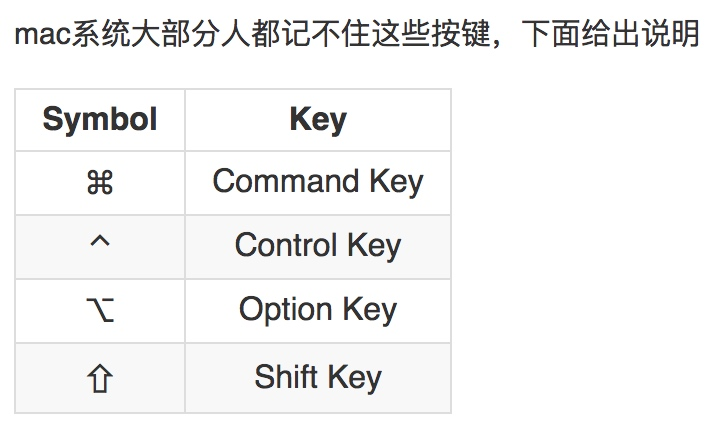

# Mac  键

> Mac 键盘值 快捷键各种

## 终端快捷键
基本命令
1、列出文件
ls 参数 目录名        例: 看看驱动目录下有什么:ls /System/Library/Extensions
参数 -w 显示中文，-l 详细信息， -a 包括隐藏文件
2、转换目录     

cd    例：想到驱动目录下溜达一圈   cd /System/Library/Extensions

3、建立新目录
mkdir 目录名     例：在驱动目录下建一个备份目录 backup     mkdir /System/Library/Extensions/backup
在桌面上建一个备份目录 backup    mkdir /User/用户名/Desktop/backup

4、拷贝文件
cp 参数 源文件 目标文件    例：想把桌面的Natit.kext 拷贝到驱动目录中  cp -R /User/用户名/Desktop/Natit.kext /System/Library/Extensions
参数R表示对目录进行递归操作，kext在图形界面下看起来是个文件，实际上是个文件夹。
把驱动目录下的所有文件备份到桌面backup
cp -R /System/Library/Extensions/* /User/用户名/Desktop/backup

5、删除文件
rm 参数 文件   例：想删除驱动的缓存  rm -rf /System/Library/Extensions.kextcache     rm -rf /System/Library/Extensions.mkext
参数－rf 表示递归和强制，千万要小心使用，如果执行了 rm -rf / 你的系统就全没了

6、移动文件
mv 文件   例：想把AppleHDA.Kext 移到桌面    mv /System/Library/Extensions/AppleHDA.kext /User/用户名/Desktop
想把AppleHDA.Kext 移到备份目录中   mv /System/Library/Extensions/AppleHDA.kext /System/Library/Extensions/backup

7、文本编辑
nano 文件名   例：编辑natit Info.plist     nano /System/Library/Extensions/Natit.kext/Info.plist

 

目录操作

命令名                       功能描述                                             使用举例

mkdir                        创建一个目录                                       mkdir dirname

rmdir                         删除一个目录                                       rmdir dirname

mvdir                        移动或重命名一个目录                         mvdir dir1 dir2

cd                             改变当前目录                                       cd dirname

pwd                          显示当前目录的路径名                          pwd

ls                              显示当前目录的内容                             ls -la

 

文件操作

命令名                                 功能描述                                  使用举例

cat                                      显示或连接文件                       cat filename

 

 

od                                       显示非文本文件的内容            od -c filename

cp                                      复制文件或目录                        cp file1 file2

rm                                     删除文件或目录                         rm filename

mv                                    改变文件名或所在目录               mv file1 file2

 

find                                  使用匹配表达式查找文件             find . -name "*.c" -print

file                                  显示文件类型                                file filename

选择操作

命令名                             功能描述                                       使用举例

head                              显示文件的最初几行                       head -20 filename

tail                                 显示文件的最后几行                       tail -15 filename

cut                                显示文件每行中的某些域                 cut -f1,7 -d: /etc/passwd

colrm                            从标准输入中删除若干列                  colrm 8 20 file2

 

diff                                比较并显示两个文件的差异                diff file1 file2

 

 

sort                             排序或归并文件                                      sort -d -f -u file1

uniq                           去掉文件中的重复行                                  uniq file1 file2

comm                        显示两有序文件的公共和非公共行              comm file1 file2

wc                            统计文件的字符数、词数和行数                    wc filename

nl                             给文件加上行号                                         nl file1 >file2

 

 

 

 

进程操作

命令名                     功能描述                                                 使用举例

ps                           显示进程当前状态                                     ps u

kill                         终止进程                                                     kill -9 30142

 

 

时间操作

命令名                           功能描述                                            使用举例

date                    显示系统的当前日期和时间                           date

cal                                   显示日历                                       cal 8 1996

time                         统计程序的执行时间                            time a.out

网络与通信操作

命令名                                功能描述                                       使用举例

telnet                                  远程登录                                 telnet hpc.sp.net.edu.cn

rlogin                                 远程登录                                 rlogin hostname -l username

rsh                       在远程主机执行指定命令                             rsh f01n03 date

ftp                   在本地主机与远程主机之间传输文件                ftpftp.sp.net.edu.cn

rcp                 在本地主机与远程主机 之间复制文件               rcp file1 host1:file2

ping                   给一个网络主机发送 回应请求                   ping hpc.sp.net.edu.cn

mail                          阅读和发送电子邮件                                          mail

write                      给另一用户发送报文                                  write username pts/1

mesg                    允许或拒绝接收报文                                                 mesg n

Korn Shell 命令              

 命令名                                 功能描述                                        使用举例

history               列出最近执行过的 几条命令及编号                       history

r                         重复执行最近执行过的 某条命令                            r -2

alias                            给某个命令定义别名                                  alias del=rm -i

unalias                     取消对某个别名的定义                                  unalias del

其它命令

命令名                                  功能描述                                         使用举例

uname                     显示操作系统的有关信息                              uname -a

clear                       清除屏幕或窗口内容                                        clear

env                        显示当前所有设置过的环境变量                         env

who                       列出当前登录的所有用户                                    who

whoami                  显示当前正进行操作的用户名                              whoami

tty                         显示终端或伪终端的名称                                         tty

stty                         显示或重置控制键定义                                        stty -a

du                                  查询磁盘使用情况                         du -k subdir
df /tmp                          显示文件系统的总空间和可用空间

w                                  显示当前系统活动的总信息

 

Mac OS X 终端命令开启功能
1.Lion下显示资源库
方法一：
显示
在“终端”中输入下面的命令：
chflags nohidden ~/Library/

隐藏
在“终端”中输入下面的命令：
chflags hidden ~/Library/

方法二：
打开Finder，菜单中选择前往按住option键就会显示资源库项(每次打开都需要重复操作一次)。

2.Finder显示隐藏文件
显示隐藏文件
在“终端”中输入下面的命令：
defaults write com.apple.finder AppleShowAllFiles -bool true
killall Finder

恢复隐藏文件
在“终端”中输入下面的命令：
defaults write com.apple.finder AppleShowAllFiles -bool false
killall Finder

3.Xcode卸载
在“终端”中输入下面的命令：
sudo /Library/uninstall-devtools –mode=all

为实际安装的目录，默认情况下Xcode安装在/Developer目录下，即可执行
sudo /Developer/Library/uninstall-devtools –mode=all

4.在Finder标题栏显示完整路径
在“终端”中输入下面的命令：
defaults write com.apple.finder _FXShowPosixPathInTitle -bool YES
killall Finder

5.去掉窗口截屏的阴影
对窗口进行截屏的时候(Command-Shift-4, 空格)，得到的图片周围会自动被加上一圈阴影。
如果你不喜欢这个阴影的效果，可以把它关掉。
在“终端”中输入下面的命令：
defaults write com.apple.screencapture disable-shadow -bool true
killall SystemUIServer

6.强制Safari在新标签中打开网页
Safari是默认支持标签浏览的。但是，我们在页面上点击链接或者在其他应用程序中点击链接的时候，
Safari往往是打开了一个新的窗口，导致页面上的Safari窗口过多，不好管理。通过下面这个小窍门，
我们可以让Safari默认是在一个新标签中打开网页。
在“终端”中输入下面的命令：
defaults write com.apple.Safari TargetedClicksCreateTabs -bool true

7.改变截屏图片的保存位置
Mac OS提供了非常方便的截屏快捷键，可以让我们非常快速的对整个屏幕、部分屏幕或者应用程序窗口进行截屏。不过，这个截屏功能有一个不足之处，就是只能将截 屏图片保存到桌面。如果我们截取的图片特别多，就会让桌面显得特别凌乱。那有没有办法来修改截屏图片的默认保存位置呢？有。方法非常简单，只要在“终端” 中输入下面的命令就可以了。
defaults write com.apple.screencapture location 存放位置
killall SystemUIServer

在输入命令的时候，将“存放位置”替换成真正的文件夹就可以了。例如，你希望存放到自己用户目录的Screenshots文件夹下，就输入
defaults write com.apple.screencapture location ~/Screenshots

 

 

Mac锁屏设置快捷键
如果用户要离开电脑一段时间，可以选择直接把笔记本直接合上。但是这样原先在跑 的进程就会挂起或者结束，如果正在下载，那么下载就被暂停（有时还不能恢复），如果正在提供网络服务，那么因为网络断了，别人也连不上你的笔记本。锁屏可 以解决这个问题，在Windows下用Win+L快捷键就锁屏了，但Mac OS X下一直没有默认的快捷键。

对于像我一样的新手，不要说设置锁屏快捷键，即便要使用其他锁屏的方法我也要到网上才能找到。其中一种方法是，首先在Finder找到“钥匙串访 问”这个实用工具（具体位置是/Applications/Utilities/Keychain Access.app），然后在“偏好设置”里选择“在菜单栏中显示钥匙串状态”。这时我们发现系统菜单多了一个像锁一样的小图标，只要点击它，就能找到 锁屏。

上述的方法实现了锁屏，但还没能达到快捷键控制锁屏的目标。虽然如此，但它的效果给我们一个锁屏思路。首先，我们要求屏幕保护程序在恢复时必须输入密码，然后锁屏问题就变成启动屏幕保护程序的问题了。Lock the screen via a keyboard shortcut这篇文章叙述了具体的实施方法。

第一步，找到“系统偏好设置”下的“安全性与隐私”，在“通用”页里勾上“进入睡眠或开始屏幕保护程序后立即要求输入密码”。

第二步，要用快捷键启动屏幕保护程序，相对复杂一点。在“应用程序”里找到“Automator”。新建一个服务，在“操作”下的“实用工具”里找 到“启动屏幕保护程序”，并把此操作拖动到右边，并且选择“没有输入”和位于“任何应用程序”，如下图所示。然后把服务保存为自己定义的名字。

最后，在“系统偏好设置”里找到“键盘”，然后为刚才定义的服务配置快捷键，我设成了Command+Control+L。

